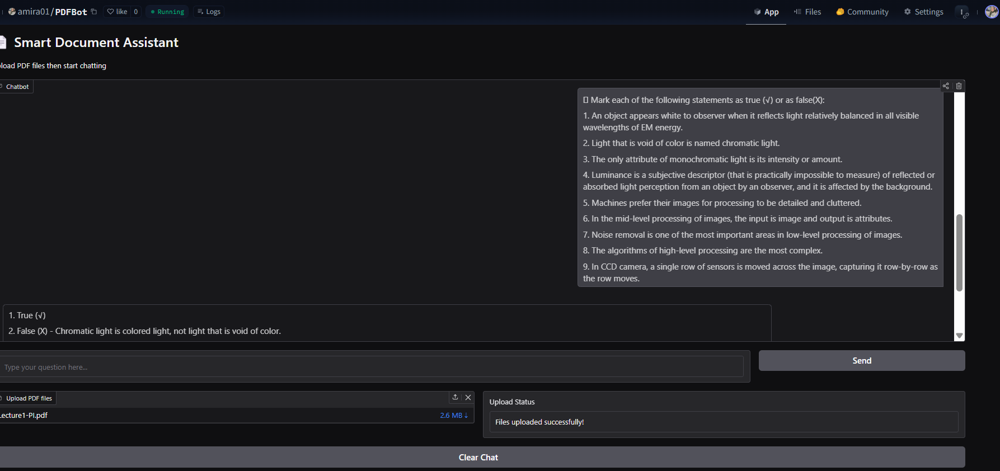

# 📄 AI-Powered PDF Q&A Assistant (2025)

**Extract precise answers from documents** with this advanced LLM-powered assistant. Processes PDFs (English/Arabic) to deliver instant Q&A, summaries, and key insights.

## 🌟 Key Features

- **Multiple PDF File Analysis**
- 📂 Concurrent Document Processing
- 🌐 Bilingual Support (English/Arabic)
- 🔍 Semantic Search Between Files

- **Intelligent Extraction**
- High Accuracy in Answer Relevancy (Tested on Legal/Technical Documents/AI Lectures)
- Generate Summaries with Key Points
- Answer True/False Questions with Error Correction

## 🛠️ Tech Stack

| Component              | Technology                          |
|------------------------|-------------------------------------|
| Document Processing    | PyPDF, LangChain                    |
| Embeddings             | Sentence-Transformers               |
| Vector Store           | FAISS                               |
| Language Model         | Mistral 7B (via OpenRouter)         |
| Interface              | Gradio                              |
| Deployment             | Hugging Face Spaces                 |

## 📌 Use Cases

1. **Legal Review** - Quickly find clauses in contracts  
2. **Academic Research** - Extract data from papers  
3. **Business Intelligence** - Analyze reports in seconds  
4. **Multilingual Docs** - Process Arabic/English content  

## 🚀 Quick Start

1. Try the live demo:  
   

📈 Performance Metrics

Processes 50-page PDF in <30 seconds.

It handles more than 30 concurrent files but it will take some time.

## 🖼️ Visual Demo

| Input Options  Analysis Output |
|------------------------------|
|   |
|   |

